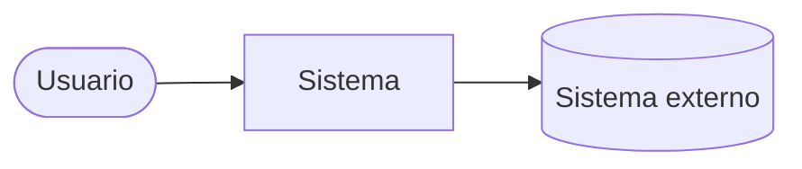
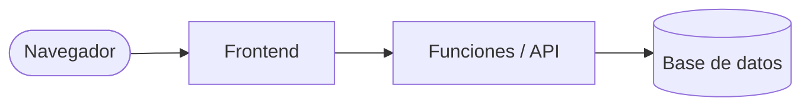

# Diseño del sistema — <nombre del proyecto>

## 1. Contexto (C4 nivel 1)

## 2. Contenedores (C4 nivel 2)

## 3. Modelo de datos

| Tabla | Campos clave | Relaciones | Datos personales |
| ----- | ------------ | ---------- | ---------------- |
|       |              |            |                  |

## 4. Matriz de roles y permisos

| Entidad | Rol A                          | Rol B |
| ------- | ------------------------------ | ----- |
|         | leer / crear / editar / borrar |       |

## 5. Pantallas y flujos

| Pantalla | Propósito | Estados cubiertos             |
| -------- | --------- | ----------------------------- |
|          |           | carga · vacío · error · éxito |

## 6. Renderizado y SEO

<Qué páginas son públicas e indexables (HTML en servidor) y cuáles quedan tras login.>

## 7. Integraciones

| Sistema | Datos que van/vienen | Qué pasa si falla |
| ------- | -------------------- | ----------------- |
|         |                      |                   |
